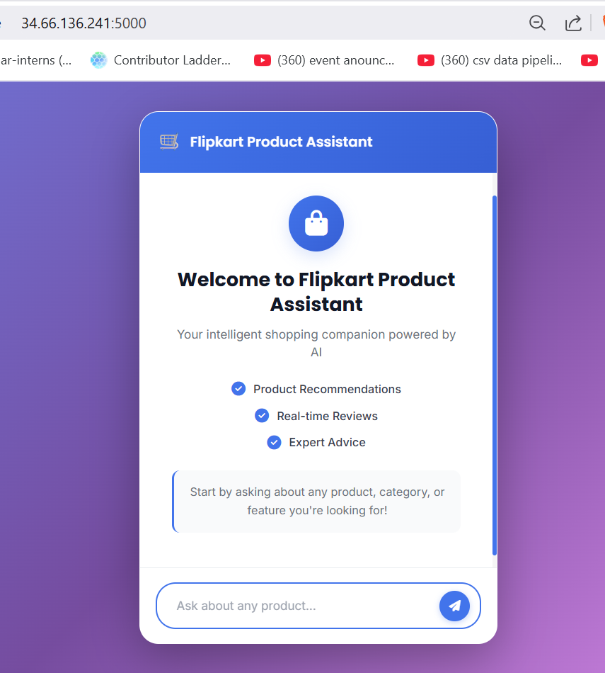
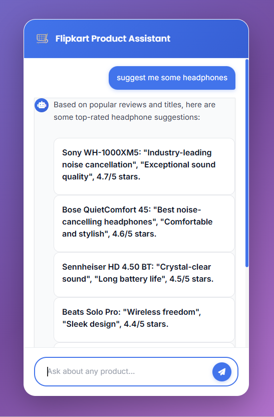
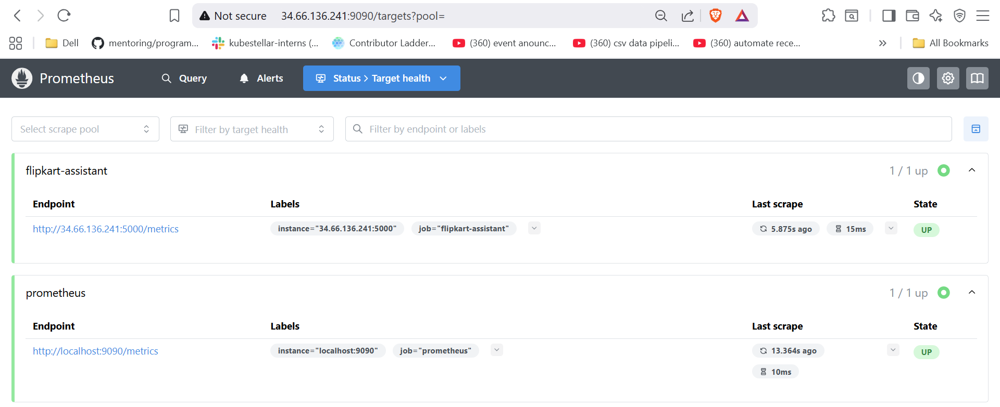
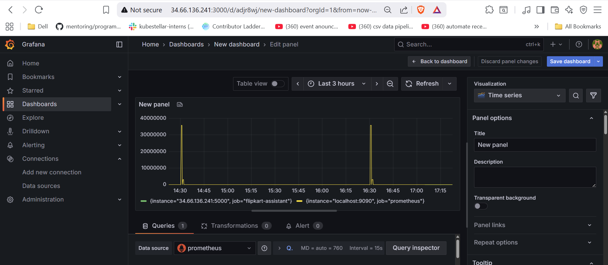

# Flipkart Product Recommender Chatbot 

An AI-powered product recommendation chatbot built with Flask, LangChain, and RAG (Retrieval-Augmented Generation), with comprehensive DevOps infrastructure with Kubernetes, Docker, Prometheus, and Grafana for production-ready deployment and monitoring.

## Preview: Flipkart Product Assistant – Full Stack Deployment and Monitoring**

### 1. Interactive Chat Interface
Users can engage in natural conversations with the AI assistant to get personalized product recommendations, ask questions about products, and receive expert advice based on real customer reviews.



### 2. Product Recommendations
The system analyzes product reviews to provide context-aware recommendations, matching user queries with the most relevant products and their features.



### 3. Prometheus Monitoring
Real-time metrics collection and monitoring of application health, request rates, and system performance through Prometheus.



### 4. Grafana Visualization
Advanced dashboards and visualizations for monitoring application metrics, performance trends, and system health.



## Tech Stack

**Backend & AI:**
- **Backend:** Flask (Python)
- **AI/ML:** LangChain + Groq LLM (Llama 3.1)
- **Vector Database:** AstraDB (Cassandra-based)
- **Embeddings:** HuggingFace (BAAI/bge-base-en-v1.5)

**DevOps & Infrastructure:**
- **Containerization:** Docker
- **Orchestration:** Kubernetes (K8s)
- **Monitoring:** Prometheus + Grafana
- **Deployment:** Render, Kubernetes clusters(Google Cloud Platform)
- **Metrics:** Prometheus Client (Python)

## Context

- **Production-Ready Infrastructure:**  
  Fully containerized with Docker and orchestrated on Kubernetes (GCP), ensuring scalable and reliable deployment across environments.

- **Real-Time Observability:**  
  Integrated Prometheus metrics collection with Grafana dashboards for continuous monitoring of application health, performance, and request analytics.

- **Efficient AI Responses:**  
  Leveraging Groq LLM (Llama 3.1) with RAG architecture, delivering quick and contextually relevant product recommendations even during high-load scenarios.

- **Retrieval-Augmented Generation (RAG):**  
  The backend integrates RAG to fetch real-time information from 990+ product reviews, ensuring users receive accurate and up-to-date product insights.

##  Features

1. **Enriched Information Retrieval from RAG:**  
   - Provides accurate and detailed product recommendations based on real customer reviews in real time.
   - Guides users to find relevant products with high accuracy using semantic vector search.

2. **History-Aware Conversations:**  
   - Maintains conversation context for natural and intuitive multi-turn interactions.

3. **Production Monitoring:**  
   - Real-time metrics tracking with Prometheus and visual dashboards in Grafana for performance insights.

4. **Scalable Deployment:**  
   - Kubernetes orchestration with horizontal scaling capabilities for handling increased load.

5. **Multi-Environment Support:**  
   - Configurable deployment across dev, staging, and production environments with automated service discovery.

##  Quick Start

### Prerequisites

- Python 3.10+
- Docker & Docker Compose (for containerized deployment)
- Kubernetes cluster (for K8s deployment)
- AstraDB account
- Groq API key

### Setup

1. **Clone the repository**

```bash
git clone https://github.com/yashsinghal2004/flipkart-product-recommender.git
cd flipkart-product-recommender
```

2. **Create and activate virtual environment**

```bash
# Create virtual environment
python -m venv venv

# Activate virtual environment
# On Windows:
venv\Scripts\activate
# On macOS/Linux:
source venv/bin/activate
```

3. **Install dependencies**

```bash
pip install -r requirements.txt
```

4. **Set up environment variables**

Create a `.env` file:

```bash
ASTRA_DB_API_ENDPOINT=your-astra-db-endpoint
ASTRA_DB_APPLICATION_TOKEN=your-astra-db-token
ASTRA_DB_KEYSPACE=your-keyspace-name
GROQ_API_KEY=your-groq-api-key
```

5. **Run locally**

```bash
python app.py
```

Server available at: `http://localhost:5000`

###  Docker Deployment

**Build the image:**

```bash
docker build -t flipkart-assistant:latest .
```

**Run the container:**

```bash
docker run -p 5000:5000 --env-file .env flipkart-assistant:latest
```

### Kubernetes Deployment

**1. Create namespace and secrets:**

```bash
kubectl create namespace flipkart
kubectl create secret generic flipkart-secrets \
  --from-literal=ASTRA_DB_API_ENDPOINT=your-endpoint \
  --from-literal=ASTRA_DB_APPLICATION_TOKEN=your-token \
  --from-literal=ASTRA_DB_KEYSPACE=your-keyspace \
  --from-literal=GROQ_API_KEY=your-key \
  -n flipkart
```

**2. Deploy application:**

```bash
kubectl apply -f app_deployment.yaml
```

**3. Deploy monitoring stack:**

```bash
# Create monitoring namespace
kubectl create namespace monitoring
kubectl apply -f prometheus/
kubectl apply -f grafana/

# Access services
kubectl port-forward svc/assistant-service 5000:80
# Prometheus: http://<node-ip>:32001
# Grafana: http://<node-ip>:32000
```

## 🏗️ Project Structure

```
.
├── app.py                      # Flask application entry point
├── Dockerfile                  # Docker containerization
├── requirements.txt            # Python dependencies
├── setup.py                   # Package installation
├── render.yaml                # Render deployment config
├── app_deployment.yaml        # Kubernetes app deployment
├── templates/                 # HTML templates
│   └── index.html
├── static/                    # CSS and static files
│   └── style.css
├── flipkart/                  # Application modules
│   ├── config.py              # Configuration management
│   ├── data_ingestion.py      # Vector store setup
│   ├── data_converter.py      # CSV to Document conversion
│   └── rag_chain.py           # RAG chain builder
├── data/                      # Data files
│   └── flipkart_product_review.csv
├── prometheus/                # Prometheus configs
│   ├── prometheus-configmap.yaml
│   └── prometheus-deployment.yaml
├── grafana/                   # Grafana configs
│   └── grafana-deployment.yaml
└── utils/                     # Utility modules
    ├── custom_exception.py
    └── logger.py
```

## Environment Variables

| Variable | Description | Required |
|----------|-------------|----------|
| `ASTRA_DB_API_ENDPOINT` | AstraDB API endpoint | Yes |
| `ASTRA_DB_APPLICATION_TOKEN` | AstraDB authentication token | Yes |
| `ASTRA_DB_KEYSPACE` | AstraDB keyspace name | Yes |
| `GROQ_API_KEY` | Groq API key for LLM | Yes |

## API Endpoints

| Endpoint | Method | Description |
|----------|--------|-------------|
| `/` | GET | Chat interface |
| `/get` | POST | Process queries |
| `/metrics` | GET | Prometheus metrics |

## Testing

```bash
# Test metrics endpoint
curl http://localhost:5000/metrics

# Test chat endpoint
curl -X POST http://localhost:5000/get -d "msg=test query"
```

## Contributing

Contributions are welcome! Please follow these steps to contribute:

1. Fork the repository.
2. Create a new branch (`git checkout -b feature/YourFeature`).
3. Commit your changes (`git commit -m 'Add YourFeature'`).
4. Push the branch (`git push origin feature/YourFeature`).
5. Open a Pull Request detailing your changes.

For major changes, please open an issue first to discuss your proposed changes.

## 📄 License

MIT License © 2025 [Yash Singhal]

